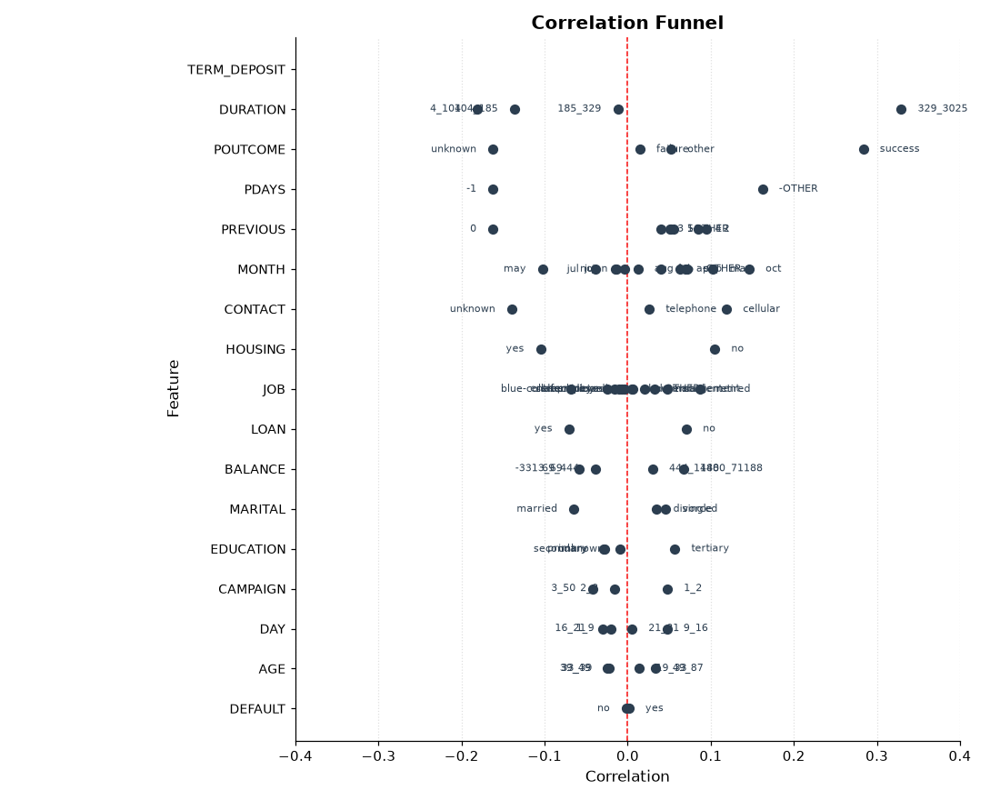
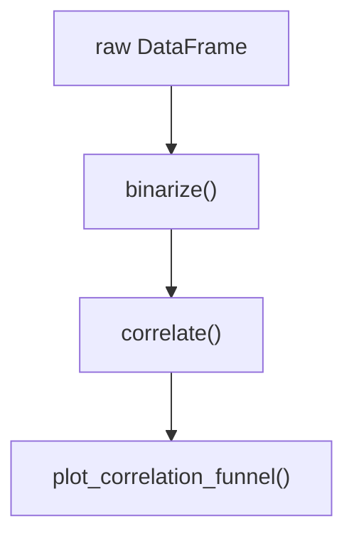

# funnel-correlation-py


[](pyproject.toml)
[](LICENSE)
[](#status)

**Status:** Functional · Python ≥3.10 · MIT

Mixed-type tables hide which feature levels actually move with a target. This library ranks those relationships in three steps so exploratory analysis starts with the strongest associations, not a wall of plots.



*Output of the Quick start code below on the bundled bank-marketing example. The plot is the library's own `plot_correlation_funnel` result, not a hand-made illustration.*



## What it does

`binarize` converts numeric and categorical columns to 0/1 features. `correlate` computes Pearson r of each feature against a chosen target. `plot_correlation_funnel` draws a tornado chart with the strongest predictors at the top. It is a Python port of Business Science's R [`correlationfunnel`](https://github.com/business-science/correlationfunnel) package.

## Quick start

```python
from funnel_correlation_py import binarize, correlate, plot_correlation_funnel
from funnel_correlation_py.data import load_marketing_campaign

df = load_marketing_campaign().drop(columns=["ID"])
binary_df = binarize(df, n_bins=4, thresh_infreq=0.01)
corr_df = correlate(binary_df, target="TERM_DEPOSIT__yes")

fig = plot_correlation_funnel(corr_df, limits=(-0.4, 0.4))
fig.tight_layout()

# interactive plot requires: pip install -e ".[interactive]"
fig_interactive = plot_correlation_funnel(corr_df, interactive=True)
fig_interactive.show()
```

## Explore this project

| Path | Start here |
|---|---|
| Fast path | [What it does](#what-it-does) and the copy-paste example above |
| Deep path | [API reference](#api-reference), [repository structure](#repository-structure), and `tests/run_validation.py` |

## Installation

```bash
pip install -e .
pip install -e ".[interactive]"   # plotly tornado chart
```

Requires Python 3.10+. Core dependencies: pandas, numpy, matplotlib.

## API reference

### `binarize(data, n_bins=4, thresh_infreq=0.01, name_infreq="-OTHER", one_hot=True)`

Converts a tidy DataFrame to binary (0/1) format.

| Parameter | Type | Default | Description |
|-----------|------|---------|-------------|
| `data` | `pd.DataFrame` | required | Input table (no datetime, no NaN) |
| `n_bins` | `int` | `4` | Quantile bins for numeric features |
| `thresh_infreq` | `float` | `0.01` | Min frequency to keep a categorical level |
| `name_infreq` | `str` | `"-OTHER"` | Label for lumped rare levels |
| `one_hot` | `bool` | `True` | `True` = all levels; `False` = drop first (dummy) |

#### What it enforces per column type

| Column dtype | Transformation |
|--------------|---------------|
| `float` / `int` (high cardinality) | Quantile binning → one-hot encode |
| `float` / `int` (low cardinality) | Treated as categorical → one-hot encode |
| `object` / `category` | Rare levels lumped → one-hot encode |
| `bool` | Cast to `int`, then binned |
| Constant column | Dropped (zero variance) |

Column names use `__` as separator: `age__18_35`, `job__admin`.

### `correlate(data, target, method="pearson")`

Computes Pearson r between every binary feature and `target`.

| Parameter | Type | Default | Description |
|-----------|------|---------|-------------|
| `data` | `pd.DataFrame` | required | Binary DataFrame from `binarize()` |
| `target` | `str` | required | Column name of the response variable |
| `method` | `str` | `"pearson"` | Passed to `pd.DataFrame.corrwith` |

Returns a tidy DataFrame with columns `feature`, `bin`, `correlation`, sorted descending by `|correlation|`. `feature` is a `pd.Categorical` ordered for correct y-axis positioning in plots.

Emits a `UserWarning` when the positive-class proportion is below 5%.

### `plot_correlation_funnel(data, interactive=False, limits=(-1,1), alpha=1.0, figsize=(10,8), title="Correlation Funnel")`

Tornado-style plot of correlation strength.

| Parameter | Type | Default | Description |
|-----------|------|---------|-------------|
| `data` | `pd.DataFrame` | required | Output of `correlate()` |
| `interactive` | `bool` | `False` | `True` returns a plotly figure |
| `limits` | `tuple` | `(-1, 1)` | X-axis range |
| `alpha` | `float` | `1.0` | Point transparency |
| `figsize` | `tuple` | `(10, 8)` | Static figure size (inches) |
| `title` | `str` | `"Correlation Funnel"` | Plot title |

## Repository structure

```
funnel_correlation_py/
  src/funnel_correlation_py/
    binarize.py      # numeric + categorical → 0/1
    correlate.py     # Pearson r vs target
    plot.py          # matplotlib / plotly tornado chart
    data.py          # example loaders + synthetic fallback
  tests/             # pytest + standalone run_validation.py
  notebooks/         # end-to-end demo on bank marketing data
```

Synthetic loaders use `numpy.random.default_rng(seed=42)`. Downloaded example tables cache under `data/raw/` on first fetch.

## Limitations

- Pearson r on binarized features is an association screen, not a causal model and not a substitute for a fitted classifier.
- Input tables must have no missing values and no datetime columns.
- Rare-level lumping and quantile bins are modelling choices (`n_bins`, `thresh_infreq`); changing them changes which levels appear strong.
- A binary target with positive-class share below 5% emits a warning; magnitudes can look decisive on small or skewed samples.
- Bundled examples are public bank-marketing / telco-churn tables, or a seeded synthetic fallback when download fails. They demonstrate the API. They are not a client conversion funnel.

## Status

**Status:** Functional

v0.1.0. The three public functions are implemented and covered by unit tests plus `PYTHONPATH=src python tests/run_validation.py`.

```bash
pip install -e ".[dev]"
PYTHONPATH=src python tests/run_validation.py
PYTHONPATH=src pytest tests/ -v
```

## License

MIT, as declared in `pyproject.toml`.

Original R package: [Business Science — correlationfunnel](https://github.com/business-science/correlationfunnel). Binary-correlation background: Duan et al., 2014, *Selecting the right correlation measure for binary data*, ACM TKDD.

## Author

<table>
  <tr>
    <td width="110">
      
    </td>
    <td>
      <strong>Rafael Braga-Kribitz</strong><br />
      Seiersberg-Pirka, Austria · Portfolio project, 2026<br />
      <a href="https://www.linkedin.com/in/rafaelbragakribitz/">LinkedIn</a>
      ·
      <a href="mailto:rafaelbragakribitz@gmail.com">rafaelbragakribitz@gmail.com</a>
    </td>
  </tr>
</table>
